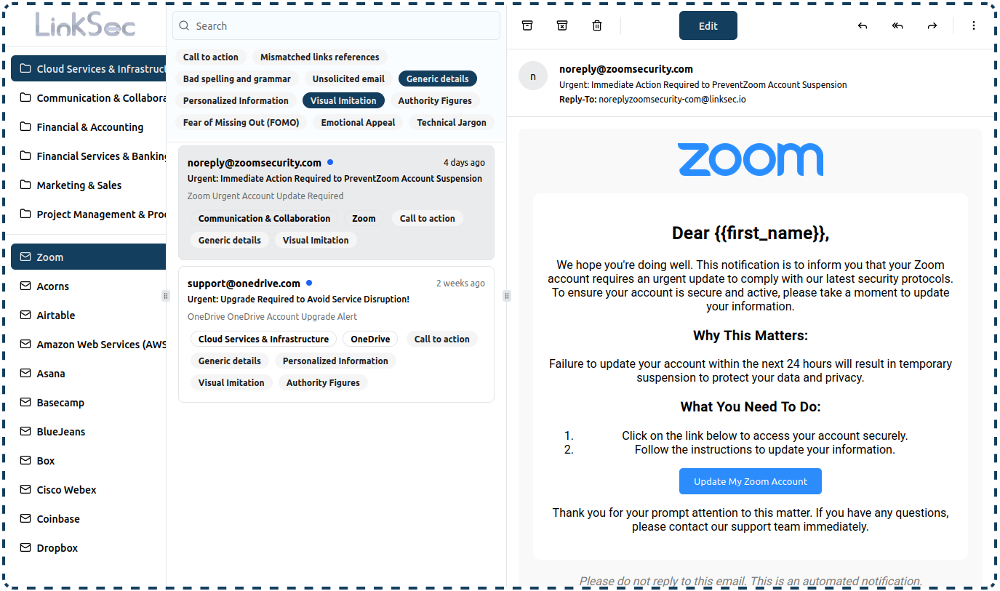
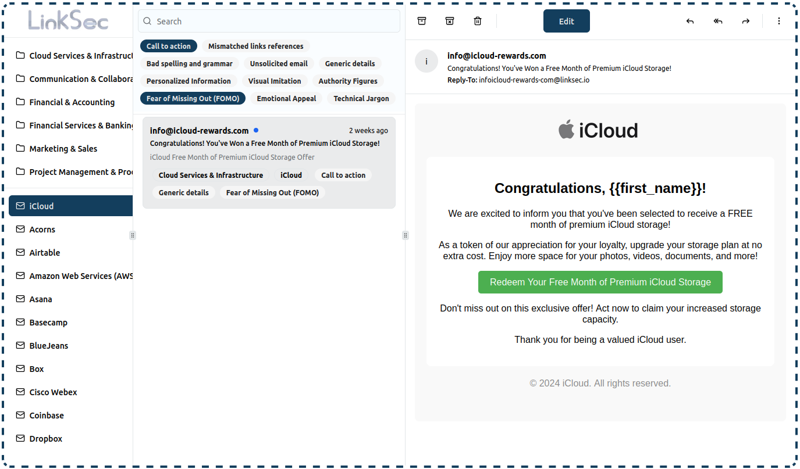

# Phishing Templates
These [phishing emails](https://linksec.io/phishing-simulator) are used by LinkSec for ethical cybersecurity awareness training.

## Emails
Countless phishing email templates based on real and fake emails of the world's largest service providers.

All emails are compatible with [GoPhish](https://github.com/gophish/gophish) and use the template pattern attributes:
- {{.Email}}
- {{.FirstName}}
- {{.URL}}
- {{.LastName}}

## Legal disclaimer
Phishing is illegal without prior mutual consent. These phishing templates, links and websites are intended to serve as resources in ethical cybersecurity awareness training programs as educational purposes only,

It's the end user's responsibility to obey all applicable local and international laws. Developers assume no liability and are not responsible for any misuse or damage caused.